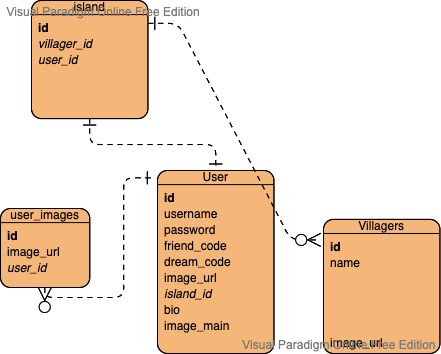

# acnhDB
## A new horizon for sharing Data

## Description
acnhDB is a website created to make sharing of islands much easier. It's created specifically for the game Animal Crossing: New Horizons, and is custom tailored to said game. With this website, the user would get a custom URL based on their username, and be able to beautifully display information about their islands, including pictures, villagers, a short description, their friend code, and their dream code.

## Tech Stack
1. Flask
2. HTML/CSS
3. TailwindCSS
4. PostgreSQL
5. Imagekit.io 

## DB Schema

## Link for project
Website: https://acnhdb.herokuapp.com/ 
API used: http://acnhapi.com/
